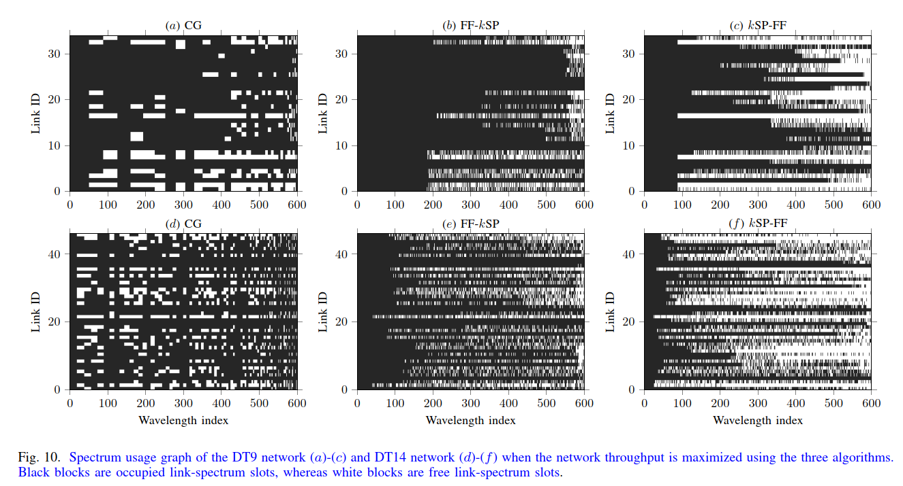

# Throughput Maximization in Multi-Band Optical Networks with Column Generation


 
 


## Project log

* 2024.02: release the code.

## Introduction
This repository is written for a paper authored by Cao CHEN, Shilin Xiao, Fen Zhou, and Massimo Tornatore, entitled *Throughput Maximization in Multi-Band Optical Networks with Column Generation*. This paper has been submitted to the conference ICC 2024.

The key contribution is the proposition of the low-complexity Column Generation (CG) decomposition approach to address the routing, wavelength, and band assignment (RWBA) problem subject to the constraints of transmission performance, spectral width, and cost of devices across multiple optical bands. Our results demonstrate the scalability of the CG-based approach when the number of wavelengths increases, with the computation time in the magnitude order of 10 s for cases varying from 75 to 1200 wavelength channels per link in a 14-node network. Such a great benefit may come from the usage of *wavelength configuration* that supports parallel spectrum allocation. Further details can be found in the original paper. 

Interested readers may refer to the original paper, or the provided example computation in a 4-node network in case you want to derive other related research with CG approach.

Hope you can enjoy it!


<pre>
@conferences{CXZT24,
      title={Throughput Maximization in Multi-Band Optical Networks with Column Generation}, 
      author={Cao Chen and Shilin Xiao and Fen Zhou and Massimo Tornatore},
      year={2024},
      eprint={2103.03095},
      archivePrefix={arXiv},
      primaryClass={cs.NI}
}
</pre>


### Pre-requirements
- Gurobi: ver 9.0 is used for the paper
- [YAMLIP-R20200930](https://github.com/yalmip/YALMIP/releases) (strongly recommended if using Gurobi 9.0, as less compatible issues between them)
- MATLAB: R2017b is used
- [export_fig](https://github.com/altmany/export_fig) (hopefully)


## How to run?

    %%
    configFile                          = 'setup/SimulationSetup_EX4.yaml';
    SimulationSetting                   = ReadYaml(configFile); 
    SimulationSetting.default_baud_rate = 50;

    [LightPathSet, isEdgeUseSlot, info] = main(SimulationSetting);

    %%
    fprintf("Running time = %g seconds\n",info('Time'));

    %%
    pause(0.1);
    figure(87),
    clf;
    imagesc(logical(isEdgeUseSlot), 'CDataMapping', 'scaled');colorbar
    title('Spectrum Usage Graph');
    xlabel('Slot');
    ylabel('Edge');
    hold off;
    %%
    itemName = {...
        'sourceNo'...
        , 'destinationNo'...
        , 'capacity'...
        , 'cost'...
        , 'strPath'...
        , 'wavelengthNo'...
        , 'transceiverNo'...
        , 'transmissionModeNo'...
        }; 
    printLightPathSet(...
        LightPathSet, ...
        itemName, ...
        'test.txt', 'w+');
    type test.txt




### Physical-Layer-Impariment Model

We strongly encourage the reader to develop the physical layer impairment by himself/herself and compute the margins of different optical bands. But in case you have no prior knowledge,  you can refer to the following physical layer impairment model that was mentioned by this paper.


```math
\alpha_{eff,w} = \alpha_w + \frac{P_t f_w C_R \hat{L}_{eff,w} + \ln \text{sinhc} (P_t B_t C_R \hat{L}_{eff,w} ) }{L_s}
```
```math
L_{eff,w} = \frac{1-\exp(-\alpha_{eff,w}L_s)}{\alpha_{eff,w}}
```

```math
P_{ASE,w} = \exp (\alpha_{eff,w} L_s)\cdot NF \cdot R_s \cdot h \cdot (f_c + f_w)
```

```math
\eta_w  \approx \frac{8}{27} \gamma_w^2 \cdot \alpha_{eff,w} \cdot L_{eff,w}^2 \frac{\text{asinh}\left(\frac{\pi^2|\beta_2| B_t^2}{2 \alpha_{eff,w}}\right)}{\pi |\beta_2| R_s^2} 
```

```math
SNR_w  = \frac{P_0}{P_{ASE,w} + \eta_w P_0^3 }
```
with $\hat{L}_{eff,w}= \frac{1- \exp(-\alpha_w L_s)}{\alpha_w}$, $\text{sinhc}(x)=\sinh(x)/x$.  The wavelength-dependent attenuation $\alpha_w$ and nonlinear coefficient $\gamma_w$ are computed as follows, $\alpha_w \approx \alpha_0+ \alpha_1  (\lambda_w-\lambda_c) + \alpha_2  (\lambda_w -\lambda_c)^2$, $\gamma_w \approx \gamma_0 + \gamma_1  (\lambda_w-\lambda_c)$, where $\alpha_0$=0.18 dB/km, $\alpha_1$=6.2e-6dB/km/nm, $\alpha_2$= 5.7e-6 dB/km/nm^2,  $\gamma_0$=1.2 /W/km, and $\gamma_1$=-2.2e-3/W/km/nm.


| Symbol    | Description                                | Value    | Unit     |
|-----------|--------------------------------------------|----------|----------|
| $\beta_2$ | group velocity   dispersion                | -21.7    | ps^2/m   |
| $R_s$     | Symbol rate                                | 32       | GBaud    |
| $B_{ch}$  | Channel spacing                            | 32       | GHz      |
| $C_R$     | Raman gain slope                           | 0.029    | W/km/THz |
| $f_R$     | Raman cutoff frequency                     | 15       | THz      |
| $L_s$      | Fiber span length                          | 100      | km       |
| $\lambda_c$      | Reference center wavelength                | 1570     | nm       |
| $c$       | Light speed                                | 3.00E+08 | m/s    |
| $h$       | Planck constant                            | 6.63E-34 | J/s     |
| $\text{NF}$      | Noise figure                               | 5        | dB       |
| $B_t$     | Total bandwidth                            | 15       | THz      |
| $B_b$      | Optical band   bandwidth      $b\in\{U,L,C\}$ | 5        | THz      |
| $P_0$     | Power per channel                          | 0.45     | mW/GHz   |
| $P_t$     | Total power                                | 0.21     | W        |


--- 
### Acknowledgment

*  Thanks Johan Löfberg for his [YAMLIP](https://yalmip.github.io/download/) project that saves my time when modelling.
*  Thanks Lloyd Russell for his yml reading file [ReadYaml.m](https://github.com/llerussell/ReadYAML)
*  Thanks professor Zhe Liang for his Chinese video [presentation](https://www.bilibili.com/video/BV1Sv411z7VY/?p=1). This video helps me to learn Column Generation.
*  The coding style of this project follows "The Elements of MATLAB Style" by Richard Johnson

